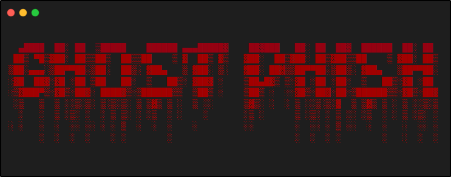

<!-- ghost-phish -->

<p align="center">
  
</p>


<p align="center"><b>A beginners friendly, Automated phishing tool with 30+ templates.</b></p>

##

<h3><p align="center">Disclaimer</p></h3>

<i>Any actions and or activities related to <b>ghost-phish</b> is solely your responsibility. The misuse of this toolkit can result in <b>criminal charges</b> brought against the persons in question. <b>The contributors will not be held responsible</b> in the event any criminal charges be brought against any individuals misusing this toolkit to break the law.

<b>This toolkit contains materials that can be potentially damaging or dangerous for social media</b>. Refer to the laws in your province/country before accessing, using,or in any other way utilizing this in a wrong way.

<b>This Tool is made for educational purposes only</b>. Do not attempt to violate the law with anything contained here. <b>If this is your intention, then Get the hell out of here</b>!

It only demonstrates "how phishing works". <b>You shall not misuse the information to gain unauthorized access to someones social media</b>. However you may try out this at your own risk.</i>

##

### Features

- Latest and updated login pages.
- Beginners friendly
- Multiple tunneling options
  - Localhost
  - Cloudflared
  - LocalXpose
- Mask URL support 
- Docker support

##

### Installation

- Just, Clone this repository -
  ```
  git clone --depth=1 https://github.com/aenoshrajora/Ghost-Phish.git
  ```

- Now go to cloned directory and run `ghost-phish.sh` -
  ```
  $ cd Ghost-Phish
  $ bash ghost-phish.sh
  ```

- On first launch, It'll install the dependencies and that's it. ***ghost-phish*** is installed.

##

### Installation (Termux)
You can easily install ghost-phish in Termux by using tur-repo
```
$ pkg install tur-repo
$ pkg install ghost-phish
$ ghost-phish
```
### A Note : 
***Termux discourages hacking*** .. So never discuss anything related to *ghost-phish* in any of the termux discussion groups. For more check : [wiki](https://wiki.termux.com/wiki/Hacking)


### Installation via ".deb" file

- Download `.deb` files from the [**Latest Release**](https://github.com/aenoshrajora/Ghost-Phish/releases/latest)
- If you are using ***termux*** then download the `*_termux.deb`

- Install the `.deb` file by executing
  ```
  apt install <your path to deb file>
  ```
  Or
  ```
  $ dpkg -i <your path to deb file>
  $ apt install -f
  ```

##

### Run on Docker

- Docker Image Mirror:
  - **DockerHub** : 
    ```
    docker pull shadowpacket/ghost-phish:latest
    ```
- Temporary Container

  ```
  docker run --rm -ti shadowpacket/ghost-phish:latest
  ```
  - Remember to mount the `auth` directory.

##

<details>
  <summary><h3>Dependencies</h3></summary>

<b>Ghost Phisher</b> requires following programs to run properly - 
- `git`
- `curl`
- `php`

> All the dependencies will be installed automatically when you run **Ghost Phish** for the first time.
</details>

<details>
  <summary><h3>Tested on</h3></summary>

- **Ubuntu**
- **Kali Linux**
- **Parrot Sec**
- **Debian**
- **Arch**
- **Manjaro**
- **Fedora**
- **Termux**
</details>

##

<h3 align="center"><i>:: Workflow ::</i></h3>
<p align="center">

</p>

##

### Find Me on:
<p align="left">
  <a href="https://www.linkedin.com/in/aenosh-rajora" target="_blank"></a>
  <a href="https://github.com/aenoshrajora" target="_blank"></a>
</p>


